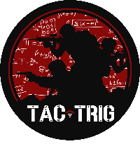

TT Squad Bot
---

> A discord bot for the TT server that handles Squad related tasks. This project depends on a backend process that aggregates stats and shits them into a redis database. This bot is simply the discord implementation that consumes the data from the redis database. The companion project for this bot can be found here [TT Stats Updater](https://github.com/z1haze/tt-squad-stats-updater)

What It Does
---

- [x] Display leaderboard stats from the squad server in a paginated list
- [x] Show individual player stats from the squad server

Usage Overview
---

#### Commands

* `/ping` - Check that the bot is online and working
* [`/leaderboard`](docs/commands/leaderboard.md) - Display a squad player leaderboard in a detailed, paginated embed message. The response for this command is ephemeral
* [`/stats`](docs/commands/stats.md) - Display a squad player's stats in a detail embed message. The response for this command is sent publicly.

How do I use this on my server?
---

#### Prerequisites

1. Node.js 17 or later (refer to the nvmrc file for the exact version)
2. A redis database that contains stats data (preferrably the one from the companion project [here](https://github.com/z1haze/tt-squad-stats-updater))

#### Installation

1. Clone this project
2. cd into the project root and `nvm use && npm install`
3. For production, you will want to build the project by running npm run build
4. Start the process for production by running start:prod (after building it in the previous step)