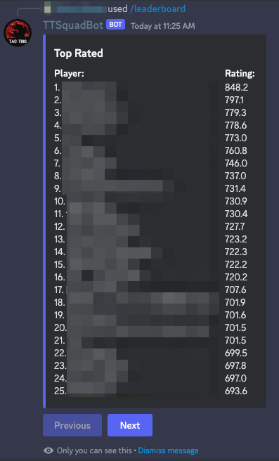

**[↤ Go Back](../../README.md)**

```bash
/leaderboard
```

This command will generate a paginated embed response showing the ranking of every single player in the server
based solely on the algorithm TT uses to rank players. Currently, at this state of project, players are ranked
solely on the quantity of kills.

It should be noted that the response to this command is ephemeral, meaning that only the user who executes the command
will see the response. This is intentional and will help to reduce the amount of leaderboard displays in the chat.

> There are lots of leaderboards, one for virtually every stacked statistic. You can view them [here](https://github.com/z1haze/tt-squad-stats-updater/blob/master/README.md)

##### Example Screenshot


