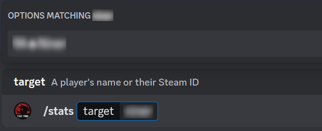

**[↤ Go Back](../../README.md)**

```bash
/stats target: <target>
```

This command will generate an embed response showing the stats of the player passed into the command. The `target`
option utilizes autocomplete functionality, which will search for players as you type. You should click from the
results in order to avoid getting a `Player not found` error.

It is likely no secret at this point that Squad does not provide any reasonable way to collect stats for players.
Our system utilizes SquadJS and the DBLog plugin to collect our metrics. Listed below are the metrics that this bot
currently tracks.

```bash
Rank on kills
Rank on revives

Kills
Deaths
K/D
Revives
Teamkills
```

##### Example Screenshot



